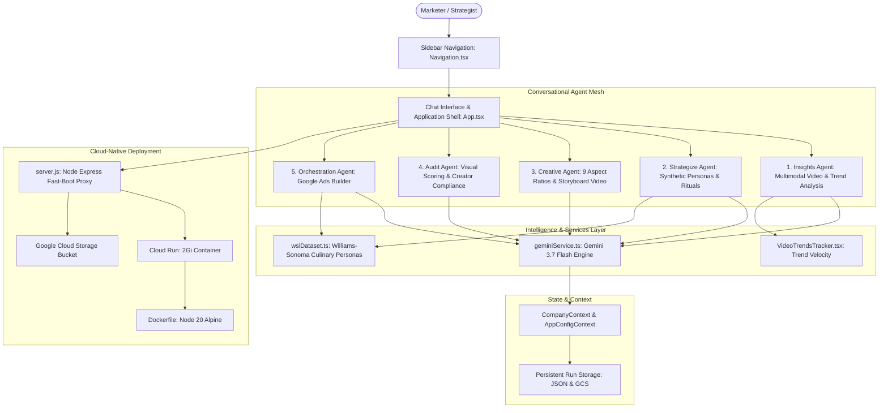

# Chat-Based AI Lab

A clean, high-velocity marketing platform powered by Gemini 3.7 Flash and Vertex AI. 
This application provides five specialized conversational AI agents that turn raw market signals and consumer data into production-ready creative, compliance, and advertising assets.



---

## The 5 Conversational Agents

### 1. Insights Agent
- **Purpose**: Mine cultural velocity, evaluate commercials, and analyze social discussions.
- **Capabilities**:
  - Multimodal ABCD video commercial analysis (Attract, Brand, Connect, Direct).
  - YouTube comment sentiment and Reddit community sentiment extraction.
  - Landing page conversion auditing.
  - Interactive video trends tracker with velocity scoring.

### 2. Strategize Agent
- **Purpose**: Bridge synthetic consumer research with strategic go-to-market planning.
- **Capabilities**:
  - 3 Calibrated Strategic Personas (*The Heirloom Traditionalist*, *The Aesthetic Host & Mixologist*, *The Kitchen Tech Purist*) plus 3 baseline controls (*Gourmet Host*, *Durability Skeptic*, *Family Generalist*).
  - Direct 1-on-1 persona interviews and broadcast focus group testing.
  - Automated visual ad creation tailored to each persona's emotional drivers.

### 3. Creative Agent
- **Purpose**: Multi-aspect ratio asset production and generative video storytelling.
- **Capabilities**:
  - Single-click asset adaptation across 9 production aspect ratios (1:1, 16:9, 9:16, 4:3, 3:4, etc.).
  - Prompt-driven image editing and scene alterations.
  - 5-step video storyboard workflow producing scene visual tables and AI video generation.

### 4. Audit Agent
- **Purpose**: Rapid visual evaluation and creator compliance verification.
- **Capabilities**:
  - Instant scorecard grading visual hierarchy, brand packaging fidelity, lighting, and commercial polish.
  - Clear Pros and Cons breakdown.
  - 10-point FTC and brand compliance sign-off for creator partner videos.

### 5. Orchestration Agent
- **Purpose**: End-to-end Google Ads campaign generation grounded in synthetic consumer data.
- **Capabilities**:
  - Interactive qualifying dialogue and 1-click fast-track presets.
  - Responsive Search Ads (RSA) with strict character limits (15 headlines ≤30 chars, 4 descriptions ≤90 chars).
  - Match-type keywords (Exact, Phrase, Broad) with benchmark CPC estimates and negatives.
  - Sitelinks, callouts, structured snippets, and audience signals.
  - Live Google Search SERP simulation.
  - 1-click export to **Google Ads Editor CSV** and TSV clipboard copy.

---

## Quick Start

### 1. Prerequisites
- Node.js 20+
- Google Cloud SDK (`gcloud`) authenticated:
  ```bash
  gcloud auth application-default login
  ```

### 2. Install & Run Locally
```bash
# Install dependencies
npm install

# Start both backend proxy server and Vite frontend
./start_local.sh
```
The application will launch on `http://localhost:8080` (or `http://localhost:5173` in development mode).

---

## Deploying to Google Cloud Run

Deploy directly to Google Cloud Run with the standard deployment script:
```bash
./cloud_run.sh
```

This will:
1. Detect and authenticate your active GCP project.
2. Verify or provision the GCS persistent storage bucket.
3. Build the container via Cloud Build using [`Dockerfile`](file:///Users/curtisgross/Documents/github/chat-based-ailab/Dockerfile).
4. Deploy the service with 2Gi memory allocation and instant-start optimization.

---

## Design Principles
- **KISS (Keep It Simple, Stupid)**: Clean UI without clutter or unneeded technical jargon.
- **No Silent Fallbacks**: Real errors surface in UI cards and browser logs for quick diagnosis.
- **Persistent Storage**: Analysis and campaign packages save to GCS and local run caches with instant **Load Last Run** buttons.
