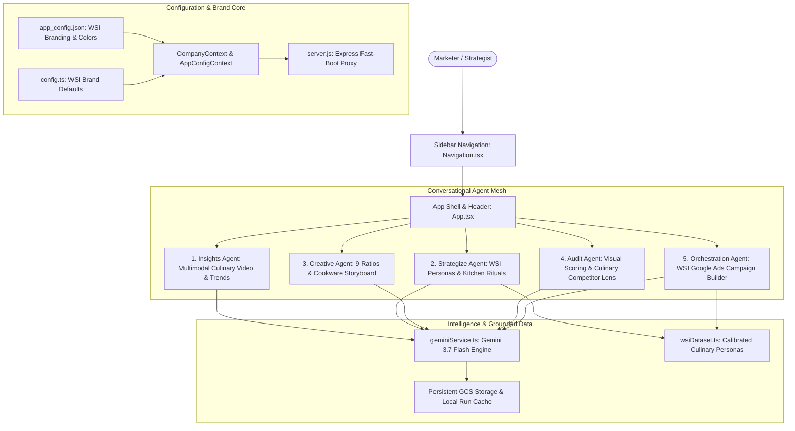

# Strategic Plan: Williams-Sonoma Brand Alignment

## Objective
Update all demonstration elements from prior brand configurations (Keurig Dr. Pepper, Squirt, Bath & Body Works) to **WSI (Williams-Sonoma)**. Ensure the system displays `WSI (Williams-Sonoma)` on startup across the backend, state providers, and user interface.

---

## Architecture Diagram (Phase 0 Audit)

---

## Technical Approach & File Changes

### Module 1: Brand Configuration & Startup Identity
* **Goal**: Ensure the system immediately starts with the brand name `WSI (Williams-Sonoma)` and culinary styling.
* **Files to change**:
  1. [`config.ts`](file:///Users/curtisgross/Documents/github/chat-based-ailab/config.ts):
     - Set `companyName` to `"WSI (Williams-Sonoma)"`.
     - Set `meta.title` to `"WSI (Williams-Sonoma) AI Lab"`.
     - Set `ui.welcomeTitle` to `"WSI (Williams-Sonoma) Marketing AI Lab"`.
     - Set palette to Williams-Sonoma culinary tones: Primary `#FFFFFF`, Secondary `#0F172A` (slate), Accent `#8B263E` (heritage burgundy/cabernet) or `#002B49` (classic navy).
     - Set `examples.privateBrands` to Williams-Sonoma lines (Thermo-Clad Cookware, Estate Cutlery, Peppermint Bark, Le Creuset Exclusives, Open Kitchen).
  2. [`public/data/configuration/app_config.json`](file:///Users/curtisgross/Documents/github/chat-based-ailab/public/data/configuration/app_config.json):
     - Set `branding.companyName` to `"WSI (Williams-Sonoma)"`.
     - Set `branding.industryType` to `"Culinary & Home Furnishings Retail"`.
     - Set `branding.metaTitle` to `"WSI (Williams-Sonoma) Marketing AI Lab"`.
     - Set `CONTENT_STUDIO` reference image to `/images/default-pot.png` (enameled French Dutch oven).
     - Update multi-image product to `"Williams Sonoma Signature Enameled Cast Iron Dutch Oven"`.
     - Update multi-image locations to luxury kitchen, sunlit marble island, and dining dinner party.
     - Update `adAnalysisVideos` to curated Williams-Sonoma culinary campaigns.
  3. [`public/data/configuration/company_context_run.json`](file:///Users/curtisgross/Documents/github/chat-based-ailab/public/data/configuration/company_context_run.json):
     - Provide initial startup context with name `"WSI (Williams-Sonoma)"` and corporate description.

### Module 2: Grounded Synthetic Datasets
* **Goal**: Replace beverage datasets with calibrated culinary customer records.
* **Files to change**:
  1. [`data/wsiDataset.ts`](file:///Users/curtisgross/Documents/github/chat-based-ailab/data/wsiDataset.ts) (New File):
     - Calibrated WSI personas:
       - *The Heirloom Culinary Traditionalist* (scratch cooking, cast iron, sourdough, Sunday family feasts).
       - *The Aesthetic Host & Mixologist* (cocktail coupes, espresso martinis, marble tablescapes, dinner parties).
       - *The Gourmet Kitchen Purist* (Breville espresso machines, Shun Japanese cutlery, high-performance cookware).
       - *The Festive Holiday Baker* (Nordic Ware bundt pans, peppermint bark, holiday gifting).
     - Quantitative dataset summary: High average order value ($185+), multi-channel buying, registry penetration.
  2. [`data/squirtDataset.ts`](file:///Users/curtisgross/Documents/github/chat-based-ailab/data/squirtDataset.ts) & [`data/drPepperDataset.ts`](file:///Users/curtisgross/Documents/github/chat-based-ailab/data/drPepperDataset.ts):
     - Re-export and alias WSI datasets to maintain backward compatibility for existing imports.
  3. [`data/simulationData.ts`](file:///Users/curtisgross/Documents/github/chat-based-ailab/data/simulationData.ts):
     - Replace soda catalog with Williams-Sonoma signature items (Le Creuset Round Dutch Oven, Thermo-Clad Stainless Cookware, Shun Classic Chef's Knife, Breville Barista Touch, Peppermint Bark, Vitamix A3500, All-Clad d5).

### Module 3: Conversational Agents Tailoring
* **Goal**: Update UI labels, agent prompts, presets, and sample videos for Williams-Sonoma.
* **Files to change**:
  1. [`components/Navigation.tsx`](file:///Users/curtisgross/Documents/github/chat-based-ailab/components/Navigation.tsx):
     - Update Strategize Agent subtitle from `"Squirt Personas & Strategy"` to `"WSI Personas & Strategy"`.
  2. [`components/Home.tsx`](file:///Users/curtisgross/Documents/github/chat-based-ailab/components/Home.tsx):
     - Update capability card description for Strategize Agent to reflect WSI culinary personas.
  3. [`components/StrategyChatAgent.tsx`](file:///Users/curtisgross/Documents/github/chat-based-ailab/components/StrategyChatAgent.tsx):
     - Update `DEFAULT_STANDARD_PERSONAS` (Joy Sun: Gourmet host & holiday baker; Arthur Vance: Discerning cookware quality & multi-clad stainless purist; Sam Taylor: Practical family home chef).
     - Update system prompt to `"You are the Master Marketing Strategist for Williams-Sonoma."`
     - Update focus group test prompts and suggested questions.
  4. [`components/OrchestrationChatAgent.tsx`](file:///Users/curtisgross/Documents/github/chat-based-ailab/components/OrchestrationChatAgent.tsx):
     - Update fallback brand to `"WSI (Williams-Sonoma)"`.
     - Update fast-track campaign presets:
       - `🍳 Heirloom Dutch Oven & Cookware ($250/day)`
       - `☕ Espresso & Smart Kitchen Electrics ($200/day)`
       - `🍷 Tableware & Entertaining Essentials ($150/day)`
     - Update live Google SERP simulation to `williams-sonoma.com/official` and WSI ad headlines.
     - Update cached run loader to target Williams-Sonoma runs.
  5. [`components/CreativeChatAgent.tsx`](file:///Users/curtisgross/Documents/github/chat-based-ailab/components/CreativeChatAgent.tsx):
     - Point sample image reference to `/images/default-pot.png` (enameled Dutch oven).
     - Update editing presets and storyboard prompts to culinary scenarios.
  6. [`components/AuditChatAgent.tsx`](file:///Users/curtisgross/Documents/github/chat-based-ailab/components/AuditChatAgent.tsx):
     - Update competitor benchmark categories:
       - Tier 1: Crate & Barrel, Sur La Table, Pottery Barn, Le Creuset, All-Clad.
       - Tier 2: Bloomingdale's Home, Nordstrom Home, Macy's, Target Hearth & Hand.
       - Tier 3: Caraway, Our Place (Always Pan), Made In, Great Jones.
     - Update sample creator audit video options to culinary demonstrations.
  7. [`components/InsightsChatAgent.tsx`](file:///Users/curtisgross/Documents/github/chat-based-ailab/components/InsightsChatAgent.tsx):
     - Update default website CRO audit URL to `https://www.williams-sonoma.com`.

### Module 4: Intelligence Layer & Seed Run Cache
* **Goal**: Specialize Gemini prompts for culinary retail and ensure "Load Last Run" works instantly.
* **Files to change**:
  1. [`services/geminiService.ts`](file:///Users/curtisgross/Documents/github/chat-based-ailab/services/geminiService.ts):
     - Set default `companyName` parameter to `"WSI (Williams-Sonoma)"`.
     - Update audience generator specialization for culinary skills, registry, gourmet food, and kitchenware.
     - Update Google Ads generation prompt and sitelink URLs for `https://www.williams-sonoma.com`.
  2. [`public/data/configuration/runs/Williams_Sonoma/`](file:///Users/curtisgross/Documents/github/chat-based-ailab/public/data/configuration/runs/Williams_Sonoma/) & [`public/data/configuration/runs/WSI__Williams_Sonoma_/`](file:///Users/curtisgross/Documents/github/chat-based-ailab/public/data/configuration/runs/WSI__Williams_Sonoma_/):
     - Seed run files for all agents:
       - `orchestration_campaign_run.json`
       - `strategy_agent_history_run.json`
       - `strategy_agent_session_run.json`
       - `strategy_personas_run_run.json`
       - `strategy_testing_run_run.json`
       - `audit_agent_history_run.json`
       - `creative_catalog_run.json`
  3. [`public/data/configuration/brand_guidelines.json`](file:///Users/curtisgross/Documents/github/chat-based-ailab/public/data/configuration/brand_guidelines.json):
     - Replace legacy Bath & Body Works guidelines with WSI culinary guidelines (gourmet kitchen luxury, heritage craftsmanship, entertaining warmth).
  4. [`public/data/configuration/focus_group_products.json`](file:///Users/curtisgross/Documents/github/chat-based-ailab/public/data/configuration/focus_group_products.json) & [`focus_group_personas.json`](file:///Users/curtisgross/Documents/github/chat-based-ailab/public/data/configuration/focus_group_personas.json):
     - Replace beverage products and personas with WSI products and customer segments.
  5. [`public/data/audiences.json`](file:///Users/curtisgross/Documents/github/chat-based-ailab/public/data/audiences.json), [`standard_audiences.json`](file:///Users/curtisgross/Documents/github/chat-based-ailab/public/data/configuration/standard_audiences.json), [`synthetic_standard_audiences.json`](file:///Users/curtisgross/Documents/github/chat-based-ailab/public/data/configuration/synthetic_standard_audiences.json):
     - Update audience cards to WSI culinary themes paired with `/images/default-pot.png`.

### Module 5: Documentation & Cloud-Native Verification
* **Goal**: Maintain architectural integrity and container build standards.
* **Files to change**:
  1. [`README.md`](file:///Users/curtisgross/Documents/github/chat-based-ailab/README.md):
     - Update Phase 0 Mermaid architecture diagram to reflect WSI dataset and culinary agent pipelines.
     - Update personas, product descriptions, and example queries.
  2. [`cloud_run.sh`](file:///Users/curtisgross/Documents/github/chat-based-ailab/cloud_run.sh):
     - Verify deployment name resolves to `wsi-chat` (matches current branch `wsi-chat`).
  3. Run `npm run build` to verify clean TypeScript compilation.

---

## Potential Risks & Mitigation
1. **Cache or Local Storage Persistence**:
   - *Risk*: A browser or local disk might look for a legacy folder name when sanitizing `WSI (Williams-Sonoma)`.
   - *Mitigation*: The `server.js` sanitizes names via `sanitizeId()`, producing `WSI__Williams_Sonoma_`. We will provide populated seed runs for both `WSI__Williams_Sonoma_` and `Williams_Sonoma` so cached reads succeed unconditionally.
2. **Missing Imports or Types**:
   - *Risk*: Legacy components might import from `squirtDataset.ts`.
   - *Mitigation*: Re-export all types and datasets from `squirtDataset.ts` while backing them with the new WSI dataset.
3. **Build Failures**:
   - *Risk*: Type mismatches between previous soda datasets and WSI datasets.
   - *Mitigation*: Maintain identical property interfaces (`SquirtConsumerRecord` / `WSIConsumerRecord`) with appropriate culinary content.

---

## Confirmation Request
Please review this plan. Upon your approval, we will proceed with the implementation.
